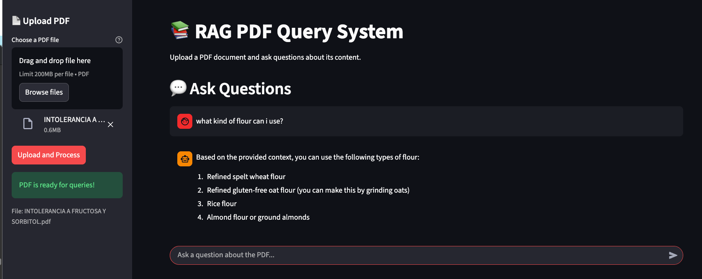

# 📄 PDF Query RAG

<div align="center">

**A hands-on RAG application that analyzes PDF documents using LangChain LCEL and OpenAI**

[](https://www.python.org/)
[](https://www.langchain.com/)
[](https://openai.com/)
[](https://fastapi.tiangolo.com/)
[](https://streamlit.io/)

*Perfect for learning LangChain LCEL, RAG architecture, and LLM-powered document intelligence*

</div>

---

## 🎯 What is This Project?

This is a **complete RAG (Retrieval Augmented Generation) application** that demonstrates how to build an intelligent system that:

- Uploads and processes PDF documents automatically

- Extracts and chunks text using LangChain

- Creates semantic embeddings for intelligent search

- Answers questions using context-aware LLM responses

**Perfect for students learning:**

- 🤖 LangChain LCEL (LangChain Expression Language)

- 📚 RAG architecture and vector stores

- 🔍 Semantic search with embeddings

- 📄 PDF processing and text chunking

- 🚀 Building full-stack AI applications

## ✨ Key Features

| Feature | Description |
|---------|-------------|
| 🧠 **Advanced RAG Pipeline** | Powered by OpenAI GPT models via LangChain LCEL |
| 📄 **PDF Processing** | Automatic text extraction and intelligent chunking |
| 🔍 **Semantic Search** | FAISS vector store with OpenAI embeddings |
| 💬 **Context-Aware Q&A** | Answers based on retrieved document context |
| ⚡ **Real-time Processing** | Upload and query documents instantly |
| 🎨 **Dual Interface** | Both Streamlit web UI and FastAPI REST API |
| 🔄 **LangChain LCEL** | Composable and maintainable chains |
| 🚀 **Production Ready** | Async/await, type hints, error handling, and best practices |

## 🏗️ Architecture Overview

```
┌─────────────────┐
│   User Query    │  "What is the main topic?"
└────────┬────────┘
         │
         ▼
┌─────────────────────────────────────┐
│      PDF Upload & Processing        │
│  ┌───────────────────────────────┐  │
│  │  1. Extract text from PDF     │  │
│  │  2. Split into chunks         │  │
│  │  3. Create embeddings         │  │
│  │  4. Store in vector DB        │  │
│  └──────────────┬────────────────┘  │
└─────────────────┼────────────────────┘
                  │
                  ▼
┌─────────────────────────────────────┐
│      LangChain LCEL Pipeline        │
│  ┌───────────────────────────────┐  │
│  │  1. Retrieve relevant chunks  │  │
│  │     using semantic search     │  │
│  └──────────────┬────────────────┘  │
│                 │                    │
│  ┌──────────────▼────────────────┐  │
│  │  2. Format context + question │  │
│  └──────────────┬────────────────┘  │
│                 │                    │
│  ┌──────────────▼────────────────┐  │
│  │  3. LLM generates answer      │  │
│  │     based on context          │  │
│  └──────────────┬────────────────┘  │
└─────────────────┼────────────────────┘
                  │
                  ▼
         ┌────────────────┐
         │  Answer with   │
         │  Source Context│
         └────────────────┘
```

---

## 🛠️ Tech Stack

<div align="center">

| Category | Technology | Purpose |
|----------|-----------|---------|
| **🤖 AI/ML** | LangChain LCEL | Chain orchestration and composability |
| | OpenAI GPT-4o-mini | LLM for question answering |
| | OpenAI Embeddings | Text embeddings for semantic search |
| **🌐 Backend** | FastAPI | REST API server |
| **💻 Frontend** | Streamlit | Interactive web interface |
| **📦 Data** | FAISS | Vector similarity search |
| | Pydantic | Type-safe models and validation |
| | PyPDF | PDF text extraction |
| **⚙️ Tools** | uv | Fast Python package manager |
| | Python 3.10+ | Programming language |

</div>

## 📦 Project Structure

```
rag-pdf-langchain/
├── core/
│   ├── __init__.py
│   ├── config.py              # ⚙️ Configuration & environment variables
│   └── rag.py                 # 🧠 LangChain RAG system
│
├── backend/
│   └── main.py                # 🚀 FastAPI app & endpoints
│
├── frontend/
│   └── app.py                 # 🎨 Streamlit web interface
│
├── uploads/                   # 📄 Uploaded PDFs directory
│
├── pyproject.toml             # 📋 Dependencies & project config
├── uv.lock                    # 🔒 Lock file
└── README.md
```

---

## 🚀 Quick Start

### Prerequisites

- **Python 3.10+** installed

- **OpenAI API Key** ([Get one here](https://platform.openai.com/api-keys))

### Installation Steps

#### 1️⃣ Install uv (if needed)

```bash
curl -LsSf https://astral.sh/uv/install.sh | sh
```

#### 2️⃣ Clone and Navigate

```bash
git clone https://github.com/JaimeLucena/rag-pdf-langchain.git
cd rag-pdf-langchain
```

#### 3️⃣ Install Dependencies

```bash
uv sync
```

This will create a virtual environment and install all required packages.

#### 4️⃣ Configure Environment

Create a `.env` file in the root directory:

```bash
# Required
OPENAI_API_KEY=sk-your-api-key-here

# Optional - Model configuration
OPENAI_MODEL=gpt-4-turbo-preview
EMBEDDING_MODEL=text-embedding-3-small

# Optional - Processing configuration
CHUNK_SIZE=1000
CHUNK_OVERLAP=200
```

> 💡 **Tip**: Never commit your `.env` file! It's already in `.gitignore`

## 🎮 Usage

### 1️⃣ Start the Backend (FastAPI)

First, start the FastAPI server:

```bash
uv run uvicorn backend.main:app --host localhost --port 8000 --reload
```

The API will be available at **http://localhost:8000**

> 💡 **Note**: Keep this terminal running. The Streamlit frontend needs the backend to be running.

### 2️⃣ Start the Frontend (Streamlit)

In a new terminal, launch the interactive web interface:

```bash
uv run streamlit run frontend/app.py
```

Then open your browser to **http://localhost:8501**

**Features:**

- 📄 PDF upload with drag & drop

- 💬 Interactive chat interface

- 📊 Visual feedback with processing status

- 🎨 Clean, modern UI

- 📝 Chat history maintained in session

### 3️⃣ Using the REST API Directly (Optional)

If you prefer to use the API directly without the web interface, you can interact with the endpoints:

**Interactive API Docs:** Visit **http://localhost:8000/docs** for Swagger UI

#### API Endpoints

| Method | Endpoint | Description |
|--------|----------|-------------|
| `GET` | `/` | API status message |
| `GET` | `/health` | Health check |
| `POST` | `/upload` | Upload and process PDF |
| `POST` | `/query` | Query the uploaded document |

#### Example API Request

```bash
# Upload a PDF
curl -X POST "http://localhost:8000/upload" \
  -F "file=@document.pdf"

# Query the document
curl -X POST "http://localhost:8000/query" \
  -H "Content-Type: application/json" \
  -d '{
    "question": "What is the main topic of this document?"
  }'
```

**Response:**

```json
{
  "answer": "The main topic of this document is..."
}
```

---

## 💡 Example Use Cases

Try these examples to see RAG in action:

### Document Analysis

- Upload research papers and ask specific questions

- Analyze business reports and extract key insights

- Query legal documents for specific clauses

- Extract information from technical manuals

### Research & Learning

- Q&A with academic papers

- Summarize long documents

- Find specific information in large PDFs

- Compare concepts across documents

### Business Intelligence

- Analyze financial reports

- Extract data from contracts

- Query product documentation

- Process customer feedback documents

---

## 🧠 How RAG Works Here

### Step-by-Step Process

1. **PDF Upload** → User uploads a PDF document

   ```
   document.pdf → Backend receives file
   ```

2. **Text Extraction** → Extract text from PDF

   ```
   PyPDFLoader extracts all text content
   ```

3. **Text Chunking** → Split into manageable chunks

   ```
   RecursiveCharacterTextSplitter creates overlapping chunks
   ```

4. **Embedding Creation** → Generate vector embeddings

   ```
   OpenAI embeddings convert text to vectors
   ```

5. **Vector Store** → Store in FAISS for fast search

   ```
   FAISS index enables semantic similarity search
   ```

6. **Query Processing** → User asks a question

   ```
   "What is the main topic?"
   ```

7. **Retrieval** → Find relevant chunks

   ```
   Semantic search returns top-k most relevant chunks
   ```

8. **Context Assembly** → Format context + question

   ```
   LangChain LCEL chain formats prompt
   ```

9. **LLM Generation** → Generate answer

   ```
   GPT model generates answer based on context
   ```

10. **Response** → Return answer to user

    ```
    "The main topic is..."
    ```

### Key Components

- **`core/rag.py`**: Core RAG system implementation

  - PDF processing and chunking

  - Vector store management

  - LangChain LCEL chain for Q&A

- **`backend/main.py`**: FastAPI endpoints

  - File upload handling

  - Query processing

  - Error handling

- **`frontend/app.py`**: Streamlit interface

  - PDF upload UI

  - Chat interface

  - API integration

---

## 📊 Response Schema

### Upload Response

```json
{
  "message": "PDF uploaded and processed successfully",
  "chunks": 42,
  "filename": "document.pdf"
}
```

### Query Response

```json
{
  "answer": "The answer based on the document context..."
}
```

---

## 🎓 Learning Objectives

By exploring this project, you'll learn:

✅ **LangChain LCEL Patterns**

- Building composable chains with `|` operator

- Prompt templates and system messages

- Retrieval-augmented generation

- Chain invocation and streaming

✅ **RAG Architecture**

- Document processing and chunking

- Vector embeddings and similarity search

- Context retrieval and assembly

- LLM-based question answering

✅ **PDF Processing**

- Text extraction from PDFs

- Intelligent text splitting

- Chunk overlap strategies

- Document metadata handling

✅ **Full-Stack AI Apps**

- Building REST APIs for AI services

- Creating interactive UIs with Streamlit

- Type-safe models with Pydantic

- Async/await patterns

✅ **Best Practices**

- Modular code organization

- Environment configuration

- Error handling

- Type hints and static checking

---

## 🔧 Development

### Running Tests

```bash
uv run pytest
```

### Code Formatting

```bash
uv run ruff format .
uv run ruff check .
```

### Project Scripts

```bash
# Run Streamlit app
uv run streamlit run frontend/app.py

# Run FastAPI server
uv run uvicorn backend.main:app --reload
```

---

## 🤔 Common Questions

**Q: Why LangChain LCEL instead of direct OpenAI calls?**  

A: LCEL provides composability, maintainability, and easy chain building. It's perfect for learning modern LLM patterns and RAG architectures.

**Q: Can I use a different LLM?**  

A: Yes! LangChain supports many providers. Just change the LLM initialization in `core/rag.py`.

**Q: How do I persist the vector store between sessions?**  

A: Currently, the vector store is in-memory. To persist it, you can save/load the FAISS index to disk.

**Q: Is this production-ready?**  

A: This is a learning project. For production, add authentication, rate limiting, logging, monitoring, and persistent vector storage.

**Q: What's the difference between chunk size and overlap?**  

A: Chunk size determines how much text is in each chunk. Overlap ensures context isn't lost at chunk boundaries, improving retrieval quality.

---

## 📚 Additional Resources

- [LangChain LCEL Documentation](https://python.langchain.com/docs/expression_language/)

- [FastAPI Documentation](https://fastapi.tiangolo.com/)

- [Streamlit Documentation](https://docs.streamlit.io/)

- [OpenAI API Reference](https://platform.openai.com/docs/)

- [FAISS Documentation](https://github.com/facebookresearch/faiss)

- [Pydantic Documentation](https://docs.pydantic.dev/)

---

## 🔧 Configuration

You can customize the application behavior through environment variables:

| Variable | Description | Default |
|----------|-------------|---------|
| `OPENAI_API_KEY` | Your OpenAI API key | Required |
| `OPENAI_MODEL` | GPT model for answers | `gpt-4-turbo-preview` |
| `EMBEDDING_MODEL` | Model for embeddings | `text-embedding-3-small` |
| `CHUNK_SIZE` | Text chunk size | `1000` |
| `CHUNK_OVERLAP` | Overlap between chunks | `200` |

## 📝 Notes

- PDFs are stored locally in the `uploads/` directory

- Vector embeddings are created in-memory (not persisted between sessions)

- Each PDF upload replaces the previous document

- Chat history is maintained within the Streamlit session

## 📝 License

MIT License - see [LICENSE](LICENSE) file for details

---

## 🙏 Acknowledgments

Built with ❤️ for students learning AI, LangChain, and RAG architecture.

**Happy Learning! 🚀**

---

<div align="center">

**Made with** ❤️ **for the AI learning community**

⭐ **Star this repo if you found it helpful!**

</div>
